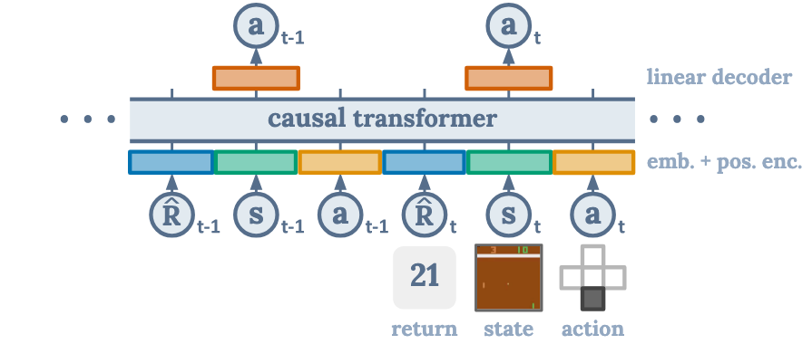
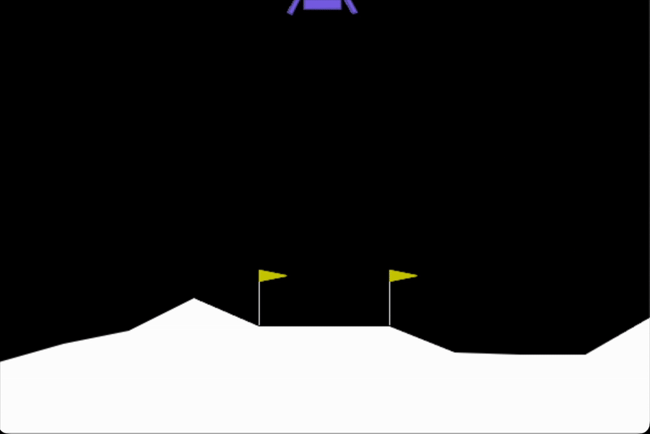
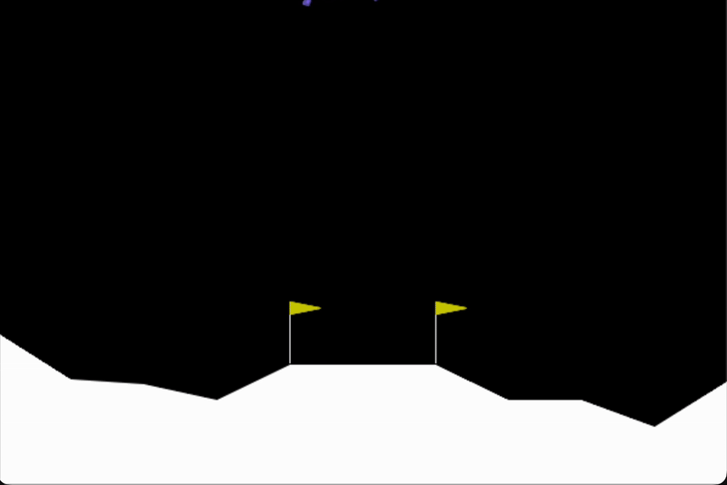
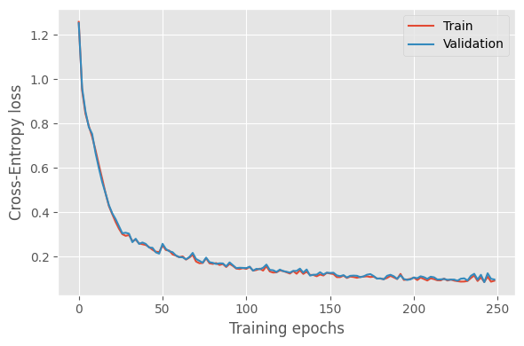
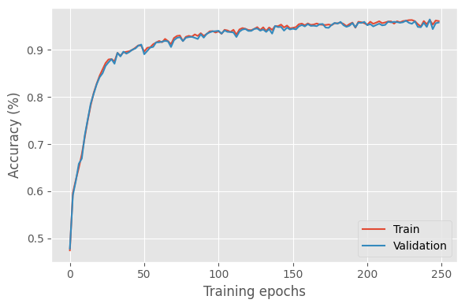
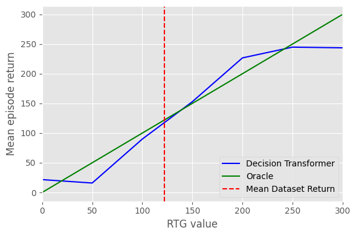

# Decision Transformer

Pytorch reimplementation of the Decision Transformer architecture described in the paper ["Decision Transformer: Reinforcement Learning via Sequence Modeling"](https://arxiv.org/abs/2106.01345) from Chen et al., 2021.



*Figure 1: Decision Transformer architecture. Taken from [Chen et al., 2021](https://arxiv.org/abs/2106.01345).*

## Lunar Lander

|  Untrained Decision Transformer | Trained Decision Transformer  |
|---------------------------------- | ----------------------------- |
|  |  |


Follow these steps to train a Decision Transformer on LunarLander-v3. Make sure you have installed all [requirements](./lunarlander/requirements.txt).

All settings and hyperparameteres can be adjusted in [config.yaml](./lunarlander/config.yaml).

### 1. "Low/Medium-Expert" Policy

First, we create a "low/medium" policy and an "expert" policy by using [Stable Baselines3](https://stable-baselines3.readthedocs.io/en/master/).

Run the script below to create a "low/medium" policy, that achives a mean episode return between 0 and 66 and an "expert" policy that achives a mean episode return > 240:

```bash
python3 ./prepro/create_policy.py --config="./lunarlander/config.yaml"
```

### 2. Data Collection

Second, we use our "low/medium-expert" policy to create a offline reinforcement learning dataset. Run the following script to create the dataset:

```bash
python3 ./prepro/create_dataset.py --config="./lunarlander/config.yaml"
```

This script will create a .npz file containing the data. 

### 3. Training

After creating the dataset, we can train our decsion transformer model by executing:

```bash
python3 ./lunarlander/train.py --config="./lunarlander/config.yaml"
```

### 4. Online Decision Transformer

We can use the trained decision transformer in the online environment by running:

```bash
python3 ./lunarlander/play.py --config="./lunarlander/config.yaml"
```

### 5. Evaluation

The plots below ([Figure 2](./assets/dt_lunarlander_loss.png), [Figure 3](./assets/dt_lunarlander_acc.png), [Figure 4](./assets/dt_lunarlander_mean_ep_return.png) and [Figure 5](./assets/dt_lunarlander_rtg_influence.png)) were produced by training on a "low/medium-expert" dataset containing 3M timesteps with an average episode return of 121, where:

* The "low/medium-expert" dataset is a concatenation of a "medium" dataset and an "expert" dataset,

* the "low/medium" dataset consists of 2.2M timesteps with an average episode return of -0.94,

* the "expert" dataset consists of 891k timesteps with an average episode return of 244.76,

The Decision Transformer was trained with the following hyperparameters:

* n_layers: 3
* n_heads: 1
* embed_dim: 128
* k_dim: 64
* v_dim: 64
* ff_dim: 2048
* dropout: 0.1
* context_length: 20

During training the decision transformer was evaluated 5-times in a row in the online environment. The column `Mean episode return..` shows the mean episode return for each rollout.

Note: *In Lunar Lander, an episode is considered a solution if it scores at least 200 points.*

| Train and validation loss during training. | Train and validation accuracy during training. |  Mean episode return for each rollout during training. | RTG influence |
| -------------------------- | ------------------------------ | ------------------- | -------------- | 
|  |  |  |  |

*Figure 2: Train and validation loss during training,*

*Figure 3: Train and validation accuracy (in percent) during training,*

*Figure 4:  Mean episode return for each rollout during training (target return-to-go was set to 250),*

*Figure 5:  Influence of the return-to-go (RTG) values used to condition the DT in Lunar Lander evluation.*

## Citations

```bibtex
@misc{chen2021decisiontransformerreinforcementlearning,
      title={Decision Transformer: Reinforcement Learning via Sequence Modeling}, 
      author={Lili Chen and Kevin Lu and Aravind Rajeswaran and Kimin Lee and Aditya Grover and Michael Laskin and Pieter Abbeel and Aravind Srinivas and Igor Mordatch},
      year={2021},
      eprint={2106.01345},
      archivePrefix={arXiv},
      primaryClass={cs.LG},
      url={https://arxiv.org/abs/2106.01345}, 
}
```

```bibtex
@misc{vaswani2023attentionneed,
      title={Attention Is All You Need}, 
      author={Ashish Vaswani and Noam Shazeer and Niki Parmar and Jakob Uszkoreit and Llion Jones and Aidan N. Gomez and Lukasz Kaiser and Illia Polosukhin},
      year={2023},
      eprint={1706.03762},
      archivePrefix={arXiv},
      primaryClass={cs.CL},
      url={https://arxiv.org/abs/1706.03762}, 
}
```
